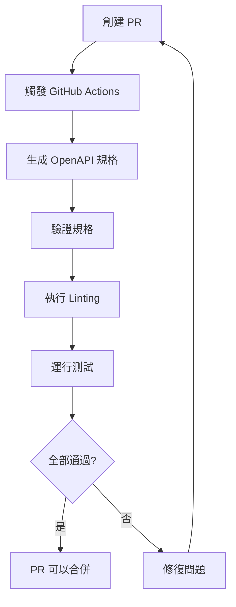

# Spec-Driven Development Quick Start

## 🚀 快速開始指南

### 1. 生成 API 規格

```bash
# 使用 Makefile
make spec

# 或直接執行
cd b2b-doc-management/backend
python generate_openapi.py
```

### 2. 驗證規格

```bash
# 使用 Makefile
make validate-spec

# 或直接執行
npx @apidevtools/swagger-cli validate openapi.json
```

### 3. 查看 API 文檔

```bash
# 啟動服務
make docker-up

# 打開瀏覽器
make docs
# 或手動訪問: http://localhost:8000/api/docs
```

## 📝 開發工作流程

### 新增 API 端點

1. **定義 Pydantic 模型**

```python
from pydantic import BaseModel

class MyRequest(BaseModel):
    """我的請求模型"""
    name: str
    age: int
    email: str | None = None
```

2. **創建 API 端點**

```python
from fastapi import APIRouter

router = APIRouter(prefix="/api", tags=["我的功能"])

@router.post("/my-endpoint")
async def my_endpoint(request: MyRequest):
    """
    我的端點描述
    
    - **name**: 使用者名稱
    - **age**: 使用者年齡
    - **email**: 可選的電子郵件
    """
    return {"message": "成功", "data": request}
```

3. **重新生成規格**

```bash
make spec
```

4. **驗證規格**

```bash
make validate-spec
```

5. **提交變更**

```bash
git add .
git commit -m "feat: add my-endpoint API"
git push
```

GitHub Actions 會自動：
- ✅ 驗證 OpenAPI 規格
- ✅ 執行 linting
- ✅ 運行測試
- ✅ 在 PR 中評論 API 變更

## 🔄 CI/CD 工作流程

### Pull Request 流程



### 自動化檢查

每次 Push 或 PR 都會自動執行：

1. **API Spec Validation**
   - 生成 OpenAPI 規格
   - 驗證規格格式
   - 評論 API 變更摘要

2. **Backend CI**
   - Flake8 linting
   - Black 格式檢查
   - Bandit 安全掃描
   - Pytest 測試

3. **Frontend CI**
   - ESLint 檢查
   - Prettier 格式檢查
   - Angular 建置
   - Karma 測試

## 💡 實用命令

### 開發環境

```bash
# 啟動完整環境
make dev

# 查看日誌
make docker-logs

# 停止環境
make docker-down
```

### 程式碼品質

```bash
# 後端 linting
make backend-lint

# 後端格式化
make backend-format

# 前端 linting
make frontend-lint

# 前端格式化
make frontend-format
```

### 測試

```bash
# 後端測試
make test-backend

# 前端測試
make test-frontend
```

### 清理

```bash
# 清理所有建置產物
make clean
```

## 📚 更多資源

- [完整 Spec-Driven 指南](../SPEC_DRIVEN_DEVELOPMENT.md)
- [FastAPI 文檔](https://fastapi.tiangolo.com/)
- [OpenAPI 規格](https://swagger.io/specification/)

## ❓ 常見問題

### Q: 如何查看當前的 API 規格？

A: 查看 `openapi.json` 檔案，或在瀏覽器中訪問 `http://localhost:8000/api/docs`

### Q: GitHub Actions 失敗怎麼辦？

A: 
1. 查看 Actions 日誌找出問題
2. 在本地執行 `make ci-all` 重現問題
3. 修復後重新推送

### Q: 如何在本地測試 API？

A: 使用 Swagger UI (`/api/docs`) 或 Postman 匯入 `openapi.json`

---

有問題？查看 [完整指南](../SPEC_DRIVEN_DEVELOPMENT.md) 或提出 Issue！
