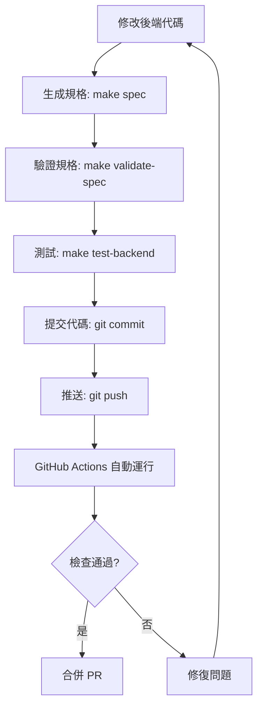

# GitHub Spec-Driven Development 實施總結

## 🎉 實施完成！

本專案已成功導入 **GitHub Spec-Driven Development (GitHub 規格驅動開發)** 方法。

## 📦 已實施的功能

### 1. OpenAPI 規格自動生成 ✅

**位置**: `/openapi.json`

**生成方式**:
```bash
# 方法 1: 使用 Makefile
make spec

# 方法 2: 直接執行腳本
cd b2b-doc-management/backend
python generate_openapi.py
```

**規格內容**:
- ✅ 21 個 API 端點
- ✅ 13 個數據模型
- ✅ 完整的請求/響應定義
- ✅ 認證機制說明
- ✅ 錯誤碼定義

### 2. GitHub Actions CI/CD 工作流程 ✅

#### 工作流程 1: API 規格驗證
**文件**: `.github/workflows/api-spec-validation.yml`

**功能**:
- 🔄 自動生成 OpenAPI 規格
- ✅ 驗證規格正確性
- 📤 上傳規格為 artifact (可下載)
- 💬 在 PR 中評論 API 變更摘要

**觸發條件**:
- Push 到 `main` 或 `develop`
- Pull Request 到 `main` 或 `develop`
- 修改 `b2b-doc-management/backend/**` 路徑

#### 工作流程 2: 後端 CI
**文件**: `.github/workflows/backend-ci.yml`

**功能**:
- 🔍 Flake8 程式碼檢查 (語法錯誤)
- 🎨 Black 格式化檢查
- 🔒 Bandit 安全性掃描
- 🧪 Pytest 測試執行 (如果存在測試)
- 📊 覆蓋率報告生成

#### 工作流程 3: 前端 CI
**文件**: `.github/workflows/frontend-ci.yml`

**功能**:
- 🔍 Angular Linting
- 🎨 Prettier 格式化檢查
- 🏗️ Angular 建置驗證
- 🧪 Karma/Jasmine 測試執行
- 📊 覆蓋率報告生成

### 3. 開發工具 - Makefile ✅

**文件**: `/Makefile`

**可用命令** (23 個):

#### OpenAPI 相關
```bash
make spec              # 生成 OpenAPI 規格
make validate-spec     # 驗證規格
make docs             # 打開 API 文檔 (需要服務運行)
```

#### 後端開發
```bash
make backend-install       # 安裝依賴
make backend-lint         # 檢查程式碼
make backend-format       # 格式化程式碼
make backend-format-check # 檢查格式
make test-backend         # 運行測試
```

#### 前端開發
```bash
make frontend-install       # 安裝依賴
make frontend-lint         # 檢查程式碼
make frontend-format       # 格式化程式碼
make frontend-format-check # 檢查格式
make frontend-build        # 建置應用
make test-frontend         # 運行測試
```

#### Docker 相關
```bash
make docker-up    # 啟動所有服務
make docker-down  # 停止所有服務
make docker-logs  # 查看日誌
```

#### CI/CD 相關
```bash
make ci-backend  # 運行後端 CI 檢查
make ci-frontend # 運行前端 CI 檢查
make ci-all      # 運行所有 CI 檢查
```

#### 其他
```bash
make dev     # 啟動開發環境
make clean   # 清理建置產物
make help    # 顯示所有可用命令
```

### 4. 完整文檔 ✅

#### 主要文檔
- **`SPEC_DRIVEN_DEVELOPMENT.md`** (4266 字元)
  - 完整的規格驅動開發指南
  - 中英文說明
  - 最佳實踐
  - 常見問題

- **`.github/SPEC_DRIVEN_QUICKSTART.md`** (2602 字元)
  - 快速開始指南
  - 開發工作流程
  - 常用命令

- **`.github/INTEGRATION_EXAMPLES.md`** (7063 字元)
  - Postman 整合範例
  - TypeScript/JavaScript 客戶端生成
  - Python 客戶端生成
  - Angular Service 範例
  - React Hook 範例
  - Mock Server 使用
  - 自動化測試

#### 更新的文檔
- **`README.md`** - 添加了規格驅動開發的連結

### 5. 改進的配置 ✅

#### `.gitignore`
- 添加了 Python cache 文件規則
- 添加了建置產物規則
- 添加了 IDE 相關規則

#### `backend/app/main.py`
- 添加了完整的 OpenAPI metadata
- 配置了自定義文檔路徑
- 添加了聯絡資訊和許可證資訊

## 🚀 如何使用

### 第一次使用

1. **查看生成的 OpenAPI 規格**:
   ```bash
   cat openapi.json
   ```

2. **啟動開發環境**:
   ```bash
   make docker-up
   ```

3. **打開 API 文檔**:
   - Swagger UI: http://localhost:8000/api/docs
   - ReDoc: http://localhost:8000/api/redoc
   - OpenAPI JSON: http://localhost:8000/api/openapi.json

### 日常開發流程



### 團隊協作

1. **開發者 A** 修改 API:
   - 更新 FastAPI 路由
   - 運行 `make spec` 生成規格
   - 提交包含 `openapi.json` 的 PR

2. **開發者 B** 基於規格開發前端:
   - 查看 PR 中的 `openapi.json` 變更
   - 或使用生成工具創建 TypeScript 客戶端
   - 實現前端功能

3. **GitHub Actions** 自動驗證:
   - 規格一致性
   - 程式碼品質
   - 測試通過

## 📊 驗證結果

### OpenAPI 規格驗證
```bash
$ npx @apidevtools/swagger-cli validate openapi.json
openapi.json is valid ✅
```

### 後端程式碼檢查
```bash
$ make backend-lint
0 errors found ✅
```

### 規格生成測試
```bash
$ make spec
✅ OpenAPI specification generated successfully!
📄 File: /path/to/openapi.json
📌 API Title: Ryan Travel Agency - B2B Document Management API
📌 API Version: 1.0.0
📌 Total Endpoints: 21
📌 Total Schemas: 13
```

## 🎯 使用場景

### 場景 1: API 開發
```bash
# 1. 修改 FastAPI 代碼
vim b2b-doc-management/backend/app/routes_v2.py

# 2. 生成並驗證規格
make spec
make validate-spec

# 3. 查看文檔
make docker-up
make docs

# 4. 提交
git add .
git commit -m "feat: add new API endpoint"
git push
```

### 場景 2: 前端整合
```bash
# 1. 獲取最新規格
git pull

# 2. 生成 TypeScript 客戶端
npx @openapitools/openapi-generator-cli generate \
  -i openapi.json \
  -g typescript-angular \
  -o src/app/generated

# 3. 使用生成的客戶端
# 在 Angular 服務中使用
```

### 場景 3: API 測試
```bash
# 1. 啟動 Mock Server
npx @stoplight/prism-cli mock openapi.json

# 2. 測試 API
curl http://localhost:4010/api/applications

# 3. 運行自動化測試
pip install schemathesis
schemathesis run openapi.json --base-url http://localhost:8000
```

## 🔄 持續改進建議

以下是未來可以進一步改進的方向：

- [ ] 添加契約測試 (Contract Testing)
- [ ] 整合 Prism Mock Server 到開發流程
- [ ] 自動生成 API 變更日誌
- [ ] 添加 API 版本管理策略
- [ ] 整合 API 效能測試
- [ ] 添加 OpenAPI Linter (如 Spectral)
- [ ] 創建 Postman Collection 並發布
- [ ] 設置 API 文檔網站 (使用 GitHub Pages)

## 📚 參考資源

- [OpenAPI Specification](https://swagger.io/specification/)
- [FastAPI 文檔](https://fastapi.tiangolo.com/)
- [GitHub Actions 文檔](https://docs.github.com/en/actions)
- [OpenAPI Generator](https://openapi-generator.tech/)

## 🆘 需要幫助?

如果遇到問題:

1. 查看 [SPEC_DRIVEN_DEVELOPMENT.md](./SPEC_DRIVEN_DEVELOPMENT.md) 的常見問題部分
2. 查看 [SPEC_DRIVEN_QUICKSTART.md](./.github/SPEC_DRIVEN_QUICKSTART.md)
3. 查看 [INTEGRATION_EXAMPLES.md](./.github/INTEGRATION_EXAMPLES.md)
4. 在 GitHub Issues 中提問

## ✅ 檢查清單

在開始使用前，確認以下事項：

- [x] OpenAPI 規格已生成 (`openapi.json` 存在)
- [x] GitHub Actions 工作流程已配置
- [x] Makefile 命令可用 (`make help` 顯示命令列表)
- [x] 文檔已創建並可訪問
- [x] `.gitignore` 已更新
- [x] 後端程式碼無語法錯誤

## 🎉 成功！

您的專案現在已經完整支援 Spec-Driven Development！

**下一步**:
1. 嘗試運行 `make spec` 生成規格
2. 啟動服務並訪問 `http://localhost:8000/api/docs`
3. 創建一個測試 PR 看看 GitHub Actions 的執行情況

---

**實施日期**: 2025-11-17  
**版本**: 1.0.0  
**狀態**: ✅ 完成
