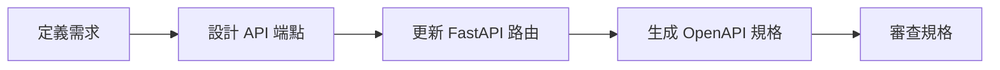

# Spec-Driven Development Guide

## 概述 (Overview)

本專案採用 **Spec-Driven Development (規格驅動開發)** 方法，使用 OpenAPI 規格作為 API 開發的單一真實來源。

This project follows a **Spec-Driven Development** approach, using OpenAPI specifications as the single source of truth for API development.

## 什麼是 Spec-Driven Development?

Spec-Driven Development 是一種開發方法論，其中：

1. **API 規格優先**: 在實作之前先定義 API 規格
2. **自動化驗證**: 使用 CI/CD 自動驗證規格的一致性
3. **文檔自動生成**: 從規格自動生成 API 文檔
4. **契約測試**: 確保前後端遵循相同的 API 契約

## 專案設置 (Project Setup)

### OpenAPI 規格

- **位置**: `/openapi.json` (repository root)
- **生成工具**: FastAPI 內建的 OpenAPI 生成器
- **文檔 URL**: 
  - Swagger UI: `http://localhost:8000/api/docs`
  - ReDoc: `http://localhost:8000/api/redoc`
  - OpenAPI JSON: `http://localhost:8000/api/openapi.json`

### 生成 OpenAPI 規格

#### 方法 1: 使用 Python 腳本

```bash
cd b2b-doc-management/backend
python generate_openapi.py
```

這會在 repository root 生成 `openapi.json` 文件。

#### 方法 2: 從運行中的服務器獲取

```bash
# 啟動服務器
cd b2b-doc-management
docker-compose up

# 在另一個終端中
curl http://localhost:8000/api/openapi.json > openapi.json
```

## GitHub Actions 工作流程

### 1. API Spec Validation (`.github/workflows/api-spec-validation.yml`)

**觸發條件:**
- Push 到 `main` 或 `develop` 分支
- Pull Request 到 `main` 或 `develop` 分支
- 修改 `b2b-doc-management/backend/**` 路徑下的文件

**功能:**
- ✅ 自動生成 OpenAPI 規格
- ✅ 驗證規格的正確性
- ✅ 上傳規格為 artifact
- ✅ 在 PR 中評論 API 變更摘要

### 2. Backend CI (`.github/workflows/backend-ci.yml`)

**功能:**
- 🔍 程式碼檢查 (flake8)
- 🎨 格式化檢查 (black)
- 🔒 安全性掃描 (bandit)
- 🧪 執行測試 (pytest)
- 📊 生成覆蓋率報告

### 3. Frontend CI (`.github/workflows/frontend-ci.yml`)

**功能:**
- 🔍 程式碼檢查 (ESLint)
- 🎨 格式化檢查 (Prettier)
- 🏗️ 建置 Angular 應用
- 🧪 執行測試 (Karma/Jasmine)
- 📊 生成覆蓋率報告

## 開發工作流程

### 1. 設計階段



### 2. 實作階段

1. **後端開發**: 
   - 更新 FastAPI 路由和模型
   - 添加請求/響應的 Pydantic 模型
   - 確保所有端點都有適當的文檔字符串

2. **生成規格**:
   ```bash
   python b2b-doc-management/backend/generate_openapi.py
   ```

3. **驗證規格**:
   ```bash
   npx @apidevtools/swagger-cli validate openapi.json
   ```

4. **前端開發**:
   - 使用生成的規格作為參考
   - 實作對應的 Angular 服務
   - 確保請求/響應格式符合規格

### 3. 測試階段

- 後端測試應該基於 OpenAPI 規格
- 使用契約測試確保符合規格
- CI/CD 會自動驗證規格的一致性

## 最佳實踐

### 1. API 設計

✅ **DO:**
- 為所有端點添加清晰的 `summary` 和 `description`
- 使用 Pydantic 模型定義所有請求/響應
- 使用適當的 HTTP 狀態碼
- 添加範例 (examples) 到模型中
- 使用標籤 (tags) 組織端點

❌ **DON'T:**
- 不要使用 `Dict[str, Any]` 作為響應類型
- 不要忽略錯誤響應的定義
- 不要使用不清楚的端點名稱

### 2. 規格維護

- 每次 API 變更後重新生成規格
- 定期審查規格的完整性
- 保持規格與實作同步
- 在 PR 中檢查規格變更

### 3. 文檔

- 使用 Swagger UI 進行互動式測試
- 在 README 中連結到 API 文檔
- 為複雜的流程添加序列圖
- 保持範例程式碼更新

## 工具推薦

### 開發工具

1. **Swagger Editor**: https://editor.swagger.io/
   - 線上編輯和驗證 OpenAPI 規格

2. **Postman**: 
   - 匯入 OpenAPI 規格進行 API 測試

3. **Swagger UI**: 
   - 已整合到 FastAPI (`/api/docs`)

### CLI 工具

```bash
# 安裝 Swagger CLI
npm install -g @apidevtools/swagger-cli

# 驗證規格
swagger-cli validate openapi.json

# 合併多個規格文件 (如果需要)
swagger-cli bundle api.yaml --outfile openapi.json
```

### VS Code 擴展

- **OpenAPI (Swagger) Editor**: 規格編輯和驗證
- **REST Client**: 直接從規格發送 HTTP 請求
- **Prettier**: 格式化 JSON/YAML 規格

## 常見問題 (FAQ)

### Q: 如何在開發時查看 API 文檔?

A: 啟動後端服務器後，訪問 `http://localhost:8000/api/docs`

### Q: 規格生成失敗怎麼辦?

A: 確保：
1. 已安裝所有 Python 依賴
2. 設置了必要的環境變數 (或使用預設值)
3. 所有 Pydantic 模型定義正確

### Q: 如何在 CI 中查看生成的規格?

A: 在 GitHub Actions 的 workflow run 中下載 "openapi-specification" artifact

### Q: 前端如何使用 OpenAPI 規格?

A: 可以使用工具如 `openapi-generator` 或 `ng-openapi-gen` 生成 Angular 服務:

```bash
npm install -g @openapitools/openapi-generator-cli

openapi-generator-cli generate \
  -i openapi.json \
  -g typescript-angular \
  -o src/app/generated
```

### Q: 如何處理 API 版本控制?

A: 
1. 使用路徑版本: `/api/v1/`, `/api/v2/`
2. 為每個版本生成獨立的規格
3. 在 FastAPI 中使用 `APIRouter` 的 `prefix` 參數

## 資源連結

- [OpenAPI Specification](https://swagger.io/specification/)
- [FastAPI Documentation](https://fastapi.tiangolo.com/)
- [Swagger Tools](https://swagger.io/tools/)
- [API Design Best Practices](https://swagger.io/resources/articles/best-practices-in-api-design/)

## 未來改進

- [ ] 添加契約測試 (Contract Testing)
- [ ] 自動生成 TypeScript 類型定義
- [ ] 添加 API 變更檢測和版本管理
- [ ] 整合 Prism Mock Server 進行開發
- [ ] 添加 API 效能測試

---

最後更新: 2025-11-17
